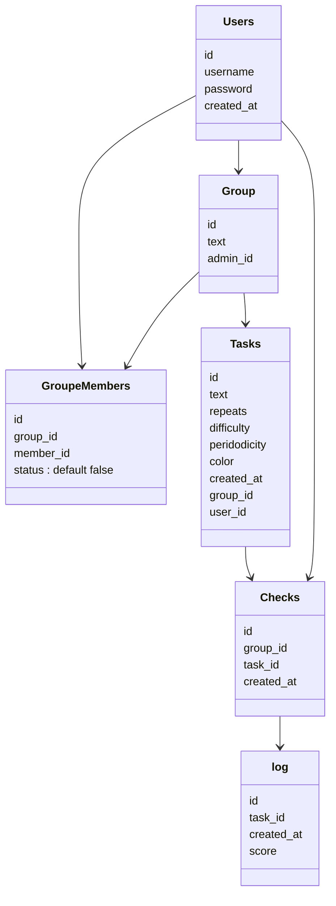

# Habit enforcer
## About the project
This project consists of creating a [Habitica](https://habitica.com/) like website using php, html and css. 
## About the website
This website is a habit enforcer, it helps users to create habits and track their progress in order to achieve their goals and become better versions of themselves.
## Rules and features
- Users can create an account and log in.
- Users can create groups and invite other users to join them.
- Users can refuse to join a group.
- Users can only belong to one group (they can quit the group if they want to).
- Users can only create habits while in a group.
- Habit creation is limited to 1 habit per day per user.
- Users can only create habits for themselves.
- Habits are created with a name, a color, a difficulty and a frequency (daily or weekly).
- Users can only check habits that are theirs and that aren't already checked in the current day/week.
- If a habit is checked score is added to the group's score.
- If a habit is not checked before the end of the day/week, score is subtracted from the group's score.
- If the group's score is below 0 the group is disbanded.

## How to run the project
- Clone the project
- Create a database named "habiti" and import the "habiti.sql" file
- Edit the "config.php" file to match your database credentials
- Use xampp, wamp or any other local server to run the project
- Run localhost/habit-enforcer-php
## Contributors 
* Yassine ENNOUHI [Gitea](https://git.ytrack.learn.ynov.com/YENNOUHI)
* Mostapha TOURABI [Gitea](https://git.ytrack.learn.ynov.com/MTOURABI1)
* Mahamat CHOUA [Gitea](https://ytrack.learn.ynov.com/git/cmahamat)

## Class diagram

# habit-enforcer-php
